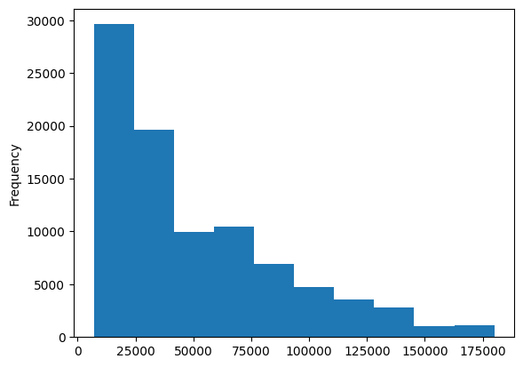
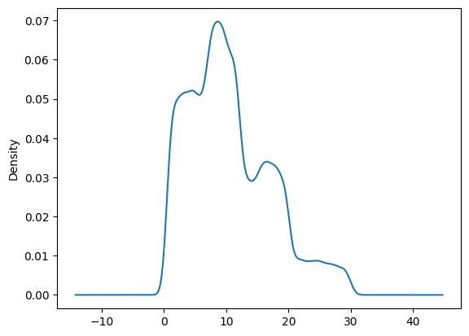
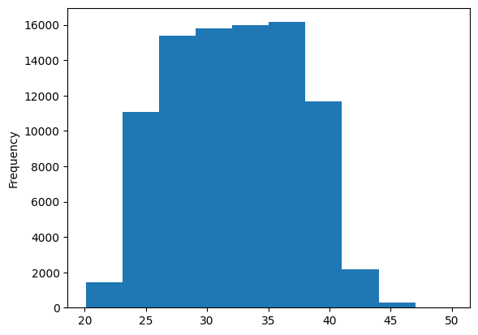
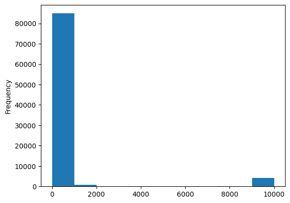
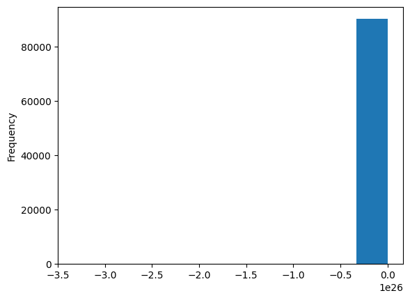
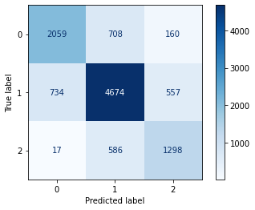

# ARTIFICIAL INTELLIGENCE AND MACHINE LEARNING FINAL PROJECT - ANALYSIS OF THE CREDICT PREDICTION DATASET

### TEAM MEMBERS: 

              -Penelope Aprea 272221
              
              -Alessandra Tiberi 265411
              
              -Giacomo Frulio 270541
     
     
## INTRODUCTION

The object of the following project is a dataset of the Credict Predictions of a financial company. The aim of the project is to design a machine learning solution to reduce the manual work of the employees and divide the users in three cathegories of credit score: Poor, Standard, and Good. This will be done in order to help the company to develop targeted products for each group.

In this project, we will perform an Explanatory data analysis (EDA) and we will generate a traing test (this will be used ONLY at the end). The dataset will be preprocessed (remove outliers, impute missing values, encode categorical features with one hot encoding) and we will test three different classifiers: Decision Tree, Random Forest, and XGBOOST.

## METHODS

The proposed dataset contains all the information needed to compute the credit score for every user. We have analyzed it through an Explanatory Data Analysis.

### CORRELATION

The first step that we decided to implement is the computation of the correlation between all the different columns. This is done to achive a better understanding of the dataset and to highlight any similarity between columns. 

In particular, we analyze and plot Annual Income, Changed Credit Limit, Credit Utilization Ratio, Amount Invested Monthly, and Monthly Balance. 
- Annual Income: the distribution of the annual income is skewed to the left. This indicates that the data is composed of a majority of lower earning people, while it gets progressively less common towards the higher earning spots

- Changed Credit Limit: The kernel density estimation shows that the credit limit is usually subject to relatively small changes, as it is to be remembered that the column shows the percentage change 

- Credit Utilization Ratio: The following histogram shows the distribution of general credit card use, which peaks at slightly more than 35 times per user

- Amount Invested Monthly: a huge majority of investments are made on smaller sums, while only an elite can invest heavily

- Monthly Balance: we are able to determine that almost every client ends its month in a slight loss

### DATA PROCESSING

First and foremost, we chose to substitute the median of the columns containing numerical values to the missing ones. We separated every column in order to make it easier to work on, even if it meant that at the moment of running every individual cell would result less comfortable and then we dropped the columns that were added during the preprocessing in order to keep a tidy dataset.

Then, we preprocessed the columns containing categorical values, in this case we decided to implement both LabelEncoder and OneHot encoding in order to make it easier to be used as part of the independent variable.
#### Label Encoding
In the 'Occupation' column, as in a couple of others, the mode of the column is substituted to the missing values, which are later converted to numerical thanks to LabelEncoding

In different columns (Type_of_Loan, Credit_Mix) we decided to use the 'value_counts' command, which allowed to visualise the most frequent value and subsequently substitute it and directly susbtitute it 
#### OneHot Encoding
We decided to implement OneHot encoding on the specific column 'Payment_of_Min_Amount' because it made sense to make use of the only 3 different values  

In the data processing we decided to include also the conversion of the categorical values for "to-be-predicted" column "Credit_Score" into numerical values because it will be required in our test with XGBOOST.
The values of Credit_Score are converted respectively from Good, Standard and Poor to 2, 1 and 0.
Then we converted the locical values of full_occ, full_paym_min_amount and full_paym_behav. True values is equal to 1 and False value is equal to 0.

### OUTLIERS REMOVAL
In simple terms, an outlier is an extremely high or extremely low data point relative to the nearest data point and the rest of the neighboring co-existing values in a data graph or dataset you're working with.

To remove the outliers, we compute the quartiles, which are needed to get the lower and upper bounds. Infact we need to check each value of the dataset and detect the presence of such outliers. 
We use the following formula to decide whether a value is an outliers or not:
- lower_bound = Q1 - 1.5 * IQR
- upper_bound = Q3 + 1.5 * IQR
- IQR = Q3 - Q1

## EXPERIMENTAL DESIGN - Credit Prediction
Our Credit Prediction divides the users in three cathegories: Good, Standard and Poor. 

We set the entirety of the preprocessed columns as independent variable and 'Credit_Score' as dependent one.

### DECISION TREE
The first classification method we implemented is the decision tree. This is an interpretable model that can explain how an outcome variable's values (Credit Prediction) can be predicted based on other values.

We imported DecisionTreeClassifier from sklearn.tree and made our predictions. Then we plotted the confusion matrix.

### RANDOM FOREST
Random Forest is a bagging technique that contains a number of decision trees on various subsets of the given dataset and takes the average to improve the predictive accuracy of that dataset.

We chose to implement the Random Forest classifier because we believed it to be interesting to compare it to the decision tree and to study the dataset with more complexity.

### XGBOOST
XGBOOST (Extreme Gradient Boost) is a scalable, distributed gradient-boosted decision tree machine learning library. It provides parallel tree boosting and is the leading machine learning library for regression, classification, and ranking problems.

## CONCLUSIONS
Our Credit Prediction has been implemented in order to maximize the efficiency of the financial company in regards to its users and the targeted products to be produced.

Our first model, the decision tree, is the least accurate (65%) this is probably due to overfitting. When a tree is particularly deep there is more overfitting. The amount of specificity leads to a smaller sample of events that meet the previous assumptions. This small sample leads to unsound conclusions.

On the other hand, the Random Forest gave us the most accurate result (76% of accuracy). This is because it is based on a large number of decision trees and each of their results. These results are combined and the most accurate prediction is made.

Finally, our third model (XGBOOST) performed extremely well with our variables. With a 74% accuracy, it is not far from our Random Forest. This happens because this method is also based on decision trees.

We noticed that by removing the outliers the accuracy increases (by definition the outliers are extreme values that stand out greatly from the overall pattern of values in a dataset or graph.)
The highest accuracy that we accomplished is 76%, however if we had a more accurate dataset our classifiers would have worked better.
